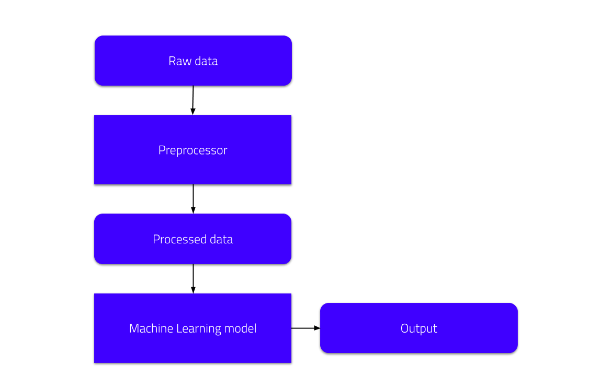
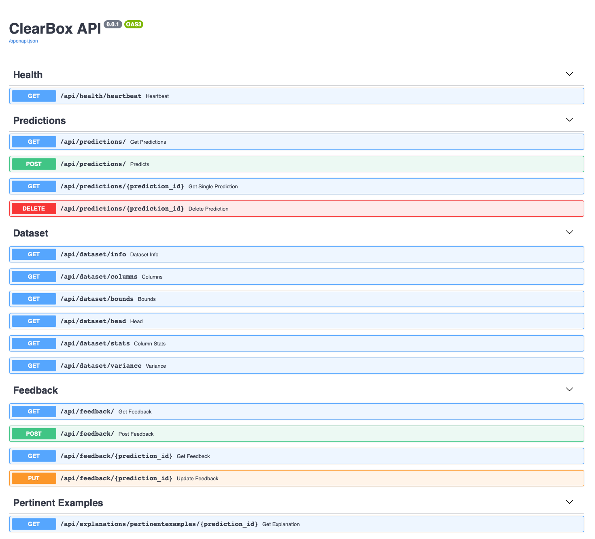

# Getting started

## Installation

This beta version of **ClearBox APP** is distributed, to facilitate its use, as a Docker container. Together with this repository you will receive credentials (_username_ and _password_) to access to our private Container Registry, so that you can build the Clearbox App Docker image. 

### Prerequisites

* Having the [latest version of Docker engine for your OS](https://docs.docker.com/install/) up and running
* Credentials to access ClearBox AI's Container Registry

### Access to ClearBox AI Container Registry

In order to download and use the ClearBox AI Docker images, you must first have access to our private Container Registry. Once you have received access to our private beta, you will be provided with a _username_ and _password_ in order to access this registry. From the terminal you will need to run the command: 
```sh
docker login -u username -p password registry.gitlab.com/clearbox-ai/clearbox-ai-core
```
In this way you will be able to build and run Docker images from our repository.

### First setup

The Clearbox API is designed to convert an existing machine learning model into an inference API. Right now the tool assumes that the machine learning model is packaged according to the pipeline shown in the figure below.



In order to instantiate the API, the user needs to provide a file containing the **raw data** used to train the model, a **preprocessor** generating the model input starting from the raw data, and the **model** itself.

This process is currently done by populating the _clearbox_backend/resources_ folder with the files specified above, saved in the right format. 

We prepared a tutorial notebook (that can be found in setup/notebooks/tutorial_setup_XGB_adult_dataset.ipynb) which demonstrates the workflow from the point of view of a data scientist.
This particular example is based on the [Adult Dataset](http://archive.ics.uci.edu/ml/datasets/Adult). Running the notebook will populate the _resources_ folder with the files needed to setup the API. If you want to skip this step, the resources folder already contains the output of this notebook.

Another folder, called _Model garden_, is provided together with the main application. Such folder contains a series of examples that can be used to test the product. Each example contains another subfolder (with the name of the used ML model) where the already created resources for that combination of dataset/model are available. It is sufficient to copy these resources into the main application inside the path _clearbox_app/resources_.

### Build the Docker image

Once the _clearbox_backend/resources_ folder is populated with the model and dataset files saved in the right formats, the ClearBox APP will automatically take care of the rest of the setup. The first setup could be slower as the app needs to create and tune a set of internal resources. 

To build and run the final Docker image it is necessary to use the _docker-compose.yml_ file present in the root folder of the repository. To do this, simply use the command:
```sh
docker-compose up
```
It will take care of building the image and launching both an instance of Mongo DB, used as persistent memory by the ClearBox App, and the APIs where it will be possible to interact with the application.

### Stop the application

To stop the application, simply run the command:
```sh
docker-compose stop
```

### Update the application

You will be notified by our team when new application updates are released. To update the application we have created a shell script, _update.sh_ in the root folder, which stops any running container, deletes the old Docker image and downloads the new updated version.

## Usage

Once the application has been launched using the `docker-compose` command, the API will be already reachable at the URL [127.0.0.1:8080](http://127.0.0.1:8080). The endpoints available through the APIs and their use are described in detail in their relative documentation ([predictions endpoints](./api/predictions.md), [explanations endpoints](./api/explanations.md), [dataset endpoints](./api/dataset.md)). A general overview of APIs and how they can be used is also available at [127.0.0.1:8080/docs](http://127.0.0.1:8080/docs).

